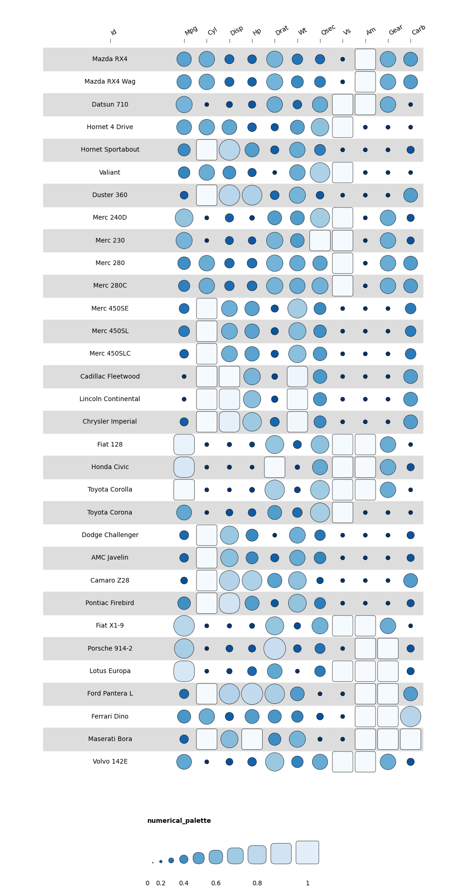
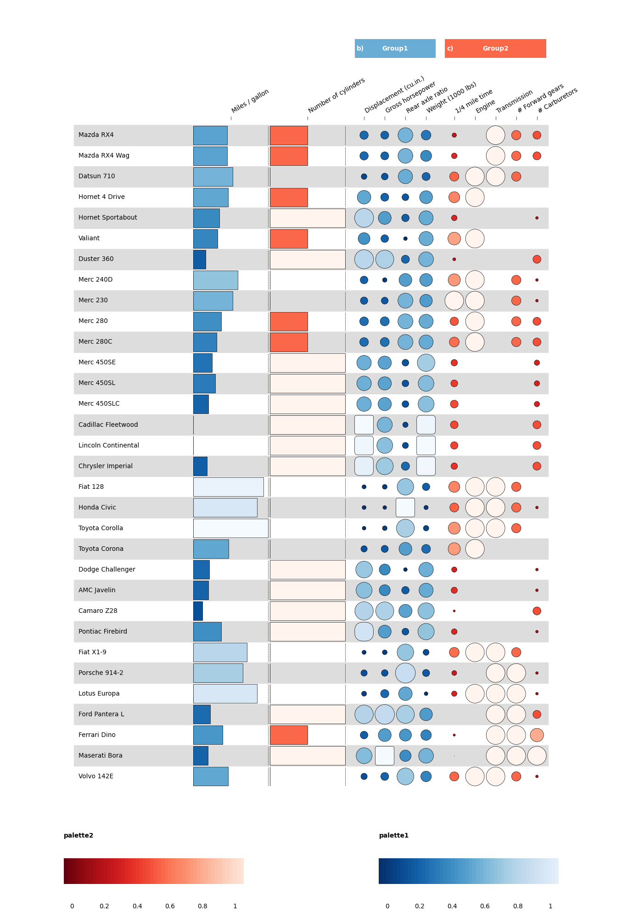

# Funkyheatmappy

Funkyheatmap in Python: Generating Funky Heatmaps for Data Frames

## Installation

You can install funkyheatmappy from GitHub using the following command:
```
pip install funkyheatmappy
```

## Usage

We use the `mtcars` dataset to demonstrate the usage of the `funkyheatmappy` package.

```python
import funkyheatmappy
import pandas as pd

mtcars = pd.read_csv("./test/data/mtcars.csv")
```

You can visualise the dataset as follows:

```python
mtcars = mtcars.rename(columns={"Unnamed: 0": "id"})

funkyheatmappy.funky_heatmap(mtcars)
```


However, it's easy to add some more information and style the plot better:

```python
column_lists = [
  ["id", "group", "name", "geom", "options", "palette"],
  ["id", np.nan, "", "text", {"ha": 0, "width": 6}, np.nan],
  ["mpg", "overall", "Miles / gallon", "bar", {"width": 4, "legend": False}, "palette1"],
  ["cyl", "overall", "Number of cylinders", "bar", {"width": 4, "legend": False}, "palette2"],
  ["disp", "group1", "Displacement (cu.in.)", "funkyrect", dict(), "palette1"],
  ["hp", "group1", "Gross horsepower", "funkyrect", dict(), "palette1"],
  ["drat", "group1", "Rear axle ratio", "funkyrect", dict(), "palette1"],
  ["wt", "group1", "Weight (1000 lbs)", "funkyrect", dict(), "palette1"],
  ["qsec", "group2", "1/4 mile time", "circle", dict(), "palette2"],
  ["vs", "group2", "Engine", "circle", dict(), "palette2"],
  ["am", "group2", "Transmission", "circle", dict(), "palette2"],
  ["gear", "group2", "# Forward gears", "circle", dict(), "palette2"],
  ["carb", "group2", "# Carburetors", "circle", dict(), "palette2"],
]

column_info = pd.DataFrame(column_lists[1:], columns=column_lists[0])
column_info.index = column_info["id"]

column_groups = pd.DataFrame(columns=["Category", "group", "palette"],
                              data = [["Overall", "overall", "palette1"],
                                      ["Group1", "group1", "palette1"],
                                      ["Group2", "group2", "palette2"]]
                            )

funkyheatmappy.funky_heatmap(mtcars, column_info = column_info, column_groups = column_groups)
```



## Documentation

Reference documentation is available at [funkyheatmap.github.io/funkyheatmappy](https://funkyheatmap.github.io/funkyheatmappy/).

